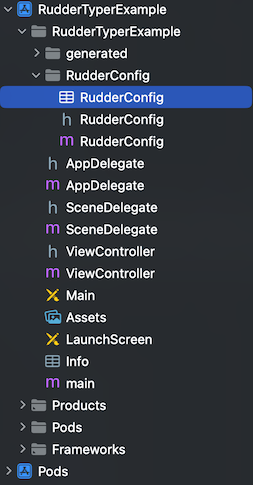

# RudderTyper - iOS (Objective C)

This is a sample iOS (Objective C) app designed to demonstrate how to use the RudderStack iOS SDK to track the RudderTyper generated events.

## Prerequisites

- Download, install and setup [Xcode](https://apps.apple.com/us/app/xcode/id497799835?mt=12).

## Getting Started

### Step 1: Open project in Xcode

- Open project path in Terminal & run `pod update`. Next open the `RudderTyperExample.xcworkspace`, located under `tests/e2e/ios-objc`, in Xcode.

### Step 2: Configure RudderStack Properties

- Update the `writeKey`, `dataPlaneUrl`, and `controlPlaneUrl` with your specific values in the `RudderConfig.plist`.

  

### Step 3: Add Generated Files

- Navigate to the `tests/e2e/ios-objc` folder in the terminal.
- Run `npx rudder-typer@next` to re-generate a client with the latest versions of these events.
- These generated files will be located under the `generated` directory.

### Step 4: Implement Event Tracking

- Add your event tracking code in the required file (ex: ViewController.m).

```
[RSRudderTyperAnalytics cartViewedWithDiscount:@23.45 email:@"test@mail2.com" employees:nil];
```

### Step 5: Run and Verify

- Run the app and verify the event in the RudderStack dashboard.
