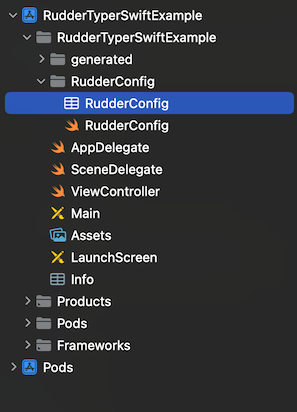

# RudderTyper - iOS (Swift)

This is a sample iOS (Swift) app designed to demonstrate how to use the RudderStack iOS SDK to track the RudderTyper generated events.

## Prerequisites

- Download, install and setup [Xcode](https://apps.apple.com/us/app/xcode/id497799835?mt=12).

## Getting Started

### Step 1: Open project in Xcode

- Open project path in Terminal & run `pod update`. Next open the `RudderTyperSwiftExample.xcworkspace`, located under `examples/ios-swift`, in Xcode.

### Step 2: Configure RudderStack Properties

- Update the `writeKey`, `dataPlaneUrl`, and `controlPlaneUrl` with your specific values in the `RudderConfig.plist`.

  

### Step 3: Add/Regenerate Analytics Files

- Run the following command to regenerate the client library based on your tracking plan using the production version of RudderTyper.

```
npx rudder-typer@latest init
```

- To regenerate the client library based on your tracking plan using the analytics files from the local repository, use the predefined shellscript file.

  Note: You can use all the supported commands of rudder-typer.

```
./rt_local_script_swift.sh
```

- Replace the existing files with the generated files under the `analytics` directory.

### Step 4: Implement Event Tracking

- Add your event tracking code in the required file (ex: ViewController.swift).

```
RSRudderTyperAnalytics.cartViewed(discount:23.45, email:@"test@mail2.com")
```

### Step 5: Run and Verify

- Run the app and verify the event in the RudderStack dashboard.
