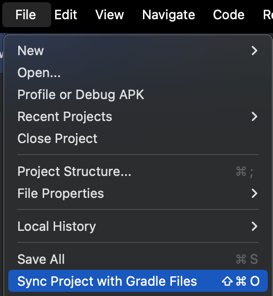

# RudderTyper - Android Kotlin

This is a sample Android Kotlin app designed to demonstrate how to use the RudderStack Android SDK to track the RudderTyper generated events.

## Prerequisites

- Download, install and setup [Android Studio](https://developer.android.com/studio/install).

## Getting Started

### Step 1: Open the `android-kotlin` folder, located under `tests/e2e`, in Android Studio

### Step 2: Configure RudderStack Properties
- Rename `rudderstack.properties.sample` to `rudderstack.properties`.
- Update the `writeKey`, `dataPlaneUrl`, and `controlPlaneUrl` with your specific values.

### Step 3: Sync Gradle

- Sync the Gradle files by clicking on the `Sync Now` link in the top right corner of the Android Studio window. Or, you can click on the `File` menu and select `Sync Project with Gradle Files`:

    

### Step 4: Add Generated Files
- Navigate to the `tests/e2e/android-kotlin` folder in the terminal.
- Run `npx rudder-typer@next` to re-generate a client with the latest versions of these events. 
- These generated files will be located under the `generated` directory.

### Step 5: Implement Event Tracking
- Add your event tracking code to the `MainActivity.kt` file:

```kotlin
private fun makeRudderTyperEvent(context: Context) {
    RudderTyperAnalytics.with(context)
        .orderCompleted(
            OrderCompleted.Builder()
                .age(23)
                .amount("123.45")
                .anonymousId("custom anonymous id")
                .arrayWithNumber(listOf(1, 2, 3))
                .build()
        )
}
```

### Step 6: Run and Verify
- Run the app and verify the event in the RudderStack dashboard.
